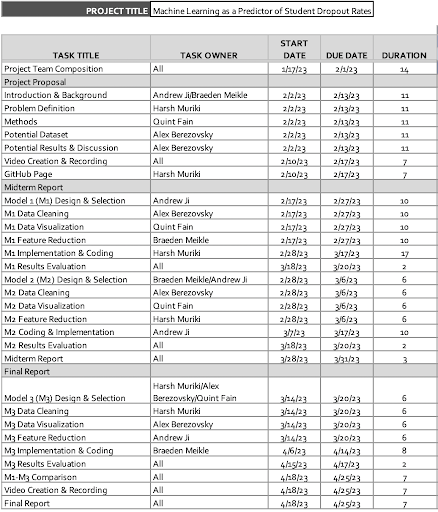

<h1>ML-based Student Dropout Prediction Model</h1>

<h2>Introduction:</h2>
Access to education during adolescence is crucial for health and is linked to parental education and socioeconomic status. Machine learning (ML) models can aid in resource allocation for education. Predictive models can also be used to identify potential dropouts, with early intervention leading to a 14% reduction in dropout rates. ML has been primarily used in previous studies through decision-tree, regression analysis, and neural networks. Factors influencing retention include student dedication, age, university entrance grade, and parental/guardian educational background. Money is not as significant a factor in dropout rates as other variables. One study focused on socioeconomic features such as age, race, human development index, family income, high school provenance, and distance to university. However, these features may not capture the full extent of a student's background. The dataset being examined consists of 35 economic, social, and demographic features for 4424 college students in Portugal.

<h2>Problem Definition:</h2>

We aim to address the issue of student dropouts by utilizing the dataset in the following ways:

1. Develop predictive models to identify student risk factors for dropout and improve retention rates.

2. Improve understanding of student progress and identify areas for improvement at individual and institutional levels.

3. Develop initiatives to improve accessibility for underprivileged groups based on demographic information in the dataset.

<h2>Methods:</h2>
In order to ensure the accuracy and efficacy of our project's analysis of student drop-out rates, we must consider the specific objectives, time frame, and data features at hand. The data sets we obtained contain demographic information on college students, including whether or not they dropped out before completing their degree. However, in order to streamline our analysis and improve our productivity, we must first determine how to prep the data by reducing irrelevant features.
To achieve this, we can utilize methods such as Principal Component Analysis (PCA) or Latent Dirichlet Allocation (LDA) to condense the data before training our predictive model. By reducing the number of superfluous features, we will improve the accuracy and efficiency of our model.
Once we have prepared the data, we utilize supervised and unspervised training methods like logistic regression, Kmeans, and Random Forests to further refine our predictive model. In particular, logistic regression is well-suited to our task, as we are seeking to predict a binary outcome: whether a student will or will not drop out. 

<h2>Potential Results and Discussion:</h2>
To estimate dropout rates of Portuguese college students from the dataset, we'll use an objective estimator scoring method or metric function API to compare and quantify changes in the model's quality. We can utilize simple scoring functions like _score, _error, or _loss from modules such as sklearn.metrics to maximize the score, indicating a better model. With a diverse dataset, we anticipate low margins of error and high model performance in determining the dropout rates.

<h2>References:</h2>
1. Berens, J., Schneider, K., Görtz, S., Oster, S., & Burghoff, J. (2018). Early detection of students
   at risk – predicting student dropouts using administrative student data and machine learning methods. SSRN Electronic Journal. https://doi.org/10.2139/ssrn.3275433

2. Burgos, C., Campanario, M.L., Peña, D. de la, Lara, J.A., Lizcano, D., Martínez, M.A.: Data  
   mining for modeling students’ performance: A tutoring action plan to prevent academic dropout.
   Comput. Electr. Eng. 66, 541–556 (2018).

3. Constate-Amores, A., Florenciano Martínez, E., Navarro Asencio, E., & Fernández-Mellizo, M.
   (2020). Factores Asociados Al Abandono Universitario. Educación XX1, 24(1). https://doi.org/10.5944/educxx1.26889

4. Freitas, F. A. da S., Vasconcelos, F. F. X., Peixoto, S. A., Hassan, M. M., Dewan, M. A. A.,
   Albuquerque, V. H. C. de, & Filho, P. P. R. (2020, October 1). IOT system for school dropout prediction using machine learning techniques based on Socioeconomic Data. MDPI. Retrieved February 19, 2023, from https://doi.org/10.3390/electronics9101613

5. Henry, K. L., Cavanagh, T. M., & Oetting, E. R. (2011). Perceived parental investment in school
   as a mediator of the relationship between socio-economic indicators and educational outcomes in rural America. Journal of youth and adolescence, 40(9), 1164–1177. https://doi.org/10.1007/s10964-010-9616-4

6. Segura, M., Mello, J., & Hernández, A. (2022). Machine learning prediction of university student
   dropout: Does preference play a key role? Mathematics, 10(18), 3359. https://doi.org/10.3390/math10183359

7. Stinebrickner, Ralph, and Todd Stinebrickner. “Academic Performance and College Dropout:
   Using Longitudinal Expectations Data to Estimate a Learning Model.” Journal of Labor Economics, vol. 32, no. 3, 2014, pp. 601–644., https://doi.org/10.1086/675308.

8. Vossensteyn, H., Kottmann, A., Jongbloed, B., Kaiser, F., Cremonini, L., Stensaker, B.,
   Hovdhaugen, E., Wollscheid, S.: Drop-Out and Completion in Higher Education in Europe - Literature Review. (2015).

<h2>Contribution Table:</h2>

| Name                        | Contribution                               |
| --------------------------- | ------------------------------------------ |
| Andy Ji                     | Introduction, Video                        |
| Braeden Meikle              | Introduction, Contribution Table, Timeline |
| Venkata Harsh Suhith Muriki | Problem Definition, GitHub                 |
| Alex Brezovsky              | Potential Results and Discussion           |
| Quint Fain                  | Methods                                    |

<h2>Contribution Table 2:</h2>

| Name                        | Contribution                               |
| --------------------------- | ------------------------------------------ |
| Andy Ji                     | Potential Results and Discussion           |
| Braeden Meikle              | Data Plotting |
| Venkata Harsh Suhith Muriki | Updating Results, Supervised & Unsupervised Learning|
| Alex Brezovsky              | Preprocessing using PCA                    |
| Quint Fain                  | Preprocessing using PCA                    |

<h2>Semester Timeline:</h2>

