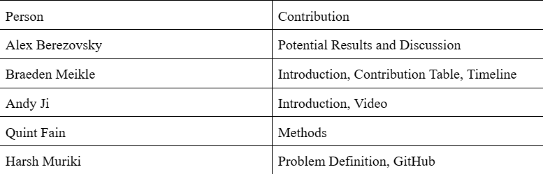

<h1>Machine Learning Models for Predicting Student Dropout</h1>

**<h2>Introduction:</h2>**
    Access to education as an adolescent is a crucial determinant of health and is directly correlated with parental educational level and socioeconomic status, presenting a viable method to utilize machine learning (ML) models for resource allocation (Henry et al., 2011). Similarly to how identifying cancer early on can be life-saving, having a model that can accurately predict if students will drop out can be utilized to prevent some students from dropping out. One study showed that if likely-to-drop-out students were recognized early and given a plan to get back on track, there was a “14% reduction in dropout rates” (Burgos et al., 2018). Having a large portion of the workforce with a college degree is beneficial to society, and preventing students from dropping out prematurely is a boon (Vossensteyn et al., 2015).
    Previous studies utilizing ML in predictive modeling for school dropout have primarily utilized decision-tree, regression analysis, and neural networks. One study in Madrid, as with its follow up study, utilized 12035 participants identified “student dedication, age, university entrance grade” and “parental/guardian educational background and student degree” as primary factors influencing retention by utilizing decision tree techniques (Constante-Amores et al., 2021; Segura et al., 2022). Similarly, a study conducted in German universities utilized the same methods but did not include many socioeconomic features (Berens et al., 2018). Surprisingly, money does not play as large of a role in dropout rates as it may seem, and many other factors have various effects (Stinebrickner, 2014). A 2020 paper focused solely on socioeconomic features of age, race, human development index, family income, high school provenance, and distance to university; however, these features are very limiting and do not encompass the full extent of a student’s background (Freitas et al., 2020).
    The dataset we will examine concerns 35 various economic, social, and demographic features of 4424 college students in Portugal.
    
****Problem Definition:****
  One of the main problems that we are trying to solve is to determine which student is likely to drop-out and provide them with the necessary support. This can be done is a variety of ways:
  **Prediction of Student Retention:** This dataset can be used to develop predictive models that can identify student risk factors for dropout and take early interventions to improve student retention rate
  **Improved Academic Performance:** Higher education institutions could better understand their students' academic progress and identify areas of improvement from both an individual and institutional perspective.
  **Accessibility Assistance:** Using the demographic information included in the dataset, institutions could develop specific initiatives designed to help certain groups more easily access higher education services or resources that may not typically be available in their area or for their social-economic class.

**Methods:**
  In order to ensure the accuracy and efficacy of our project's analysis of student drop-out rates, we must consider the specific objectives, time frame, and data features at hand. The data sets we obtained contain demographic information on college students, including whether or not they dropped out before completing their degree. However, in order to streamline our analysis and improve our productivity, we must first determine how to prep the data by reducing irrelevant features.
  To achieve this, we can utilize methods such as Principal Component Analysis (PCA) or Latent Dirichlet Allocation (LDA) to condense the data before training our predictive model. By reducing the number of superfluous features, we will improve the accuracy and efficiency of our model.
  Once we have prepared the data, we can utilize supervised training methods like neural networks or logistic regression to further refine our predictive model. In particular, logistic regression is well-suited to our task, as we are seeking to predict a binary outcome: whether a student will or will not drop out.

**Potential Results and Discussion**
  To estimate dropout rates of Portuguese college students based on the features from the data set, we will use some type of estimator scoring method or metric function. We want to ensure that we have an objective way to measure or estimate the quality of our model to be able to discuss and compare changes in the model in an quantitative manner. An estimator scoring method or metric function API is something that will fit into our project very well.
  We will use the scoring methods, through whichever API we choose to utilize, to get a “score” for our model, where-in the method returns a value we are trying to maximize. The higher the value, the better our model. We can use simple modules such as sklearn.metrics to use simple scoring functions such as _score, _error,  or _loss, depending on what we value in measuring the accuracy and quality of our model, with error or loss functions returning values we would want to minimize.
  The data set we are working with is easily usable, and with a plethora of different data to evaluate and feed into our model we will have a lot of success in our goal of determining the dropout rates of Portuguese college students. We will be expecting quite low margins of error and a high returning score for our model once we develop it.

**Contribution Table:**

**Semester TimeLine**

