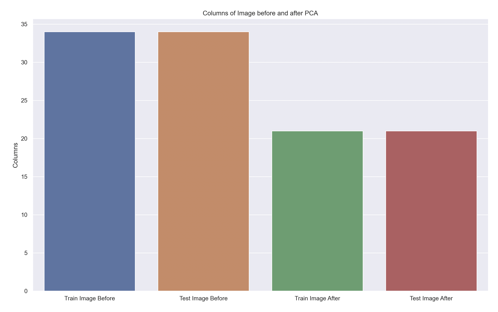

<h1>ML-based Student Dropout Prediction Model</h1>

<h2>Introduction:</h2>
Access to education during adolescence is crucial for health and is linked to parental education and socioeconomic status. Machine learning (ML) models can aid in resource allocation for education. Predictive models can also be used to identify potential dropouts, with early intervention leading to a 14% reduction in dropout rates. ML has been primarily used in previous studies through decision-tree, regression analysis, and neural networks. Factors influencing retention include student dedication, age, university entrance grade, and parental/guardian educational background. Money is not as significant a factor in dropout rates as other variables. One study focused on socioeconomic features such as age, race, human development index, family income, high school provenance, and distance to university. However, these features may not capture the full extent of a student's background. The dataset being examined consists of 35 economic, social, and demographic features for 4424 college students in Portugal.

<h2>Problem Definition:</h2>

We aim to address the issue of student dropouts by utilizing the dataset in the following ways:

1. Develop predictive models to identify student risk factors for dropout and improve retention rates.

2. Improve understanding of student progress and identify areas for improvement at individual and institutional levels.

3. Develop initiatives to improve accessibility for underprivileged groups based on demographic information in the dataset.

<h2>Data Collection:</h2>
In order to ensure the accuracy and efficacy of our project's analysis of student drop-out rates, we must consider the specific objectives, time frame, and data features at hand. The data sets we obtained contain demographic information on college students, including whether or not they dropped out before completing their degree. However, in order to streamline our analysis and improve our productivity, we must first determine how to prep the data by reducing irrelevant features.
To achieve this, we utilized Principal Component Analysis (PCA) to condense the data before training our predictive model. By reducing the number of superfluous features, we will improve the accuracy and efficiency of our model. Below, we can see how PCA reduced the amount of columns of `train_img` and `test_img` from 34 to 21. PCA also reduced the size of `test_img` by about 43% and `train_img` by 37.5%. This was performed using sklearn with an 80-20 split between training and testing data, and 90% variance being implemented in PCA.

<h2>Methods:</h2>
To classify the data and identify student risk factors for dropout, we implemented 4 models: Logistic Regression, Random Forest, Neural Network, and K Means Clustering using sklearn. The first two methods are both supervised learning models, Logistic Regression and Random Forest. The last model is K-means, and unsupervised model. We hope that this diversity in model selection will yield conclusive results and allow us to find the most suitable model for our data.

<h2>Results and Discussion:</h2>
To estimate dropout rates of Portuguese college students from the dataset, we used sklearn's _score function. With a diverse dataset, we anticipated low margins of error and high model performance in determining the dropout rates, though this was not the case for all models. Our supervised models are far from perfect and report accuracies at 75% (logistic regression) and 78% (random forest). These results indicate the necessity of fine tuning of hyperparameters (especially with the random forest model), including features considered when splitting nodes and the exact number of decision trees in the forest model. Logistic regression hyperparameters using sklearn include solver (algorithm), penalty (regularization - generalization and regulation of overfitting), and C (regularization strength).

Using sklearn's model.coef_ function, we were able to identify the features that had the most significant impact on student dropout rate. In the case of the logistic regression model, only three features that had significant above 0.08: 'Curricular units 2nd sem (grade)' at ~0.09, and more significantly 'Tuition-Fees Up to Date' and  'International Student' at >.25 and >.17 respectively. 

Using the decision tree model, several more features were highlighted: 'Tuition-Fees Up to Date' at >0.06, 'Age of Enrollment' at ~0.045, and more importantly 'Curricular units 2nd sem (grade)' at ~0.15, 'Curricular units 2nd sem (approved)' at ~.13, plus 'Curricular units 1st sem (evaluations)' and 'Curricular units 1st sem (approved)' at ~0.08. 

Though the weights the features are differing across models, the major commonalities include 'Tuition-Fees Up to Date' and 'Curricular units 2nd sem (grade)'. This suggests that in order to combat student dropout rate, university systems should consider these features as a starting point.

Unfortunately, the accuracy of K-means sits at -18,000 (even after optimal clusters = 5 found using elbow method, see figure below), and as the sklearns kmeans accuracy method demonstrates that 'good clustering' scores are close to 0, this method needs significant improvement. However, as kmeans maximizes intercluster distances and is an unsupervised model (does not use labels in training), a better metric of accuracy may be the Rand Index, which we will run for the next submission. Utilizing the Silhouette  Score yielded a result 0.009, and as higher scores (bounded betweeen -1 and 1) indicate better clustering, the clustering in this model was poor with clusters not being very distinct - the data may not have followed non-convex shapes. We can continue to improve the accuracies of our models by playing with the regularation of our model, removing data for currently "Enrolled" students from the data set, and by increasing the number of iterations we run K-means for. 

Using the Elbow method, we can see that about 5 clusters is optimal:

Howeer, the neural networks model that was constructed using sklearn had an astounding 89% accuracy. The neural networks model demonstrated increased accuracy as the number of features increased, though the number of epochs did not significantly increase accuracy after 5 epochs. This high accuracy rate can be attributed to the capacity of neural networks to handle complex data, such as student dropout data with the multitude of features.

<h2>Conclusion:</h2>
Similarly to how identifying cancer early on can be life-saving, having a model that can accurately predict if students will drop out can be utilized to prevent some students from dropping out. One study showed that if likely-to-drop-out students were recognized early and given a plan to get back on track, there was a “14% reduction in dropout rates” (Burgos et al., 2018). 

Previous studies utilizing ML in predictive modeling for school dropout have primarily utilized decision-tree, regression analysis, and neural networks. One study in Madrid, as with its follow up study, utilized 12035 participants identified “student dedication, age, university entrance grade” and “parental/guardian educational background and student degree” as primary factors influencing retention by utilizing decision tree techniques (Constante-Amores et al., 2021; Segura et al., 2022). Similarly, a study conducted in German universities utilized the same methods but did not include many socioeconomic features (Berens et al., 2018). Surprisingly, money does not play as large of a role in dropout rates as it may seem, and many other factors have various effects (Stinebrickner, 2014). A 2020 paper focused solely on socioeconomic features of age, race, human development index, family income, high school provenance, and distance to university; however, these features are very limiting and do not encompass the full extent of a student’s background (Freitas et al., 2020).

Our study utilized the random forest decision-tree model, k-means clustering, logistic regression, and neural networks: most of which have been used in prior research. Using the logistic regression and random forest model, we identified 'Tuition-Fees Up to Date' and 'Curricular units 2nd sem (grade)' as potential areas of focus in improving the student retention rate. These results align with previous studies in the impact of socioeconomic status on outcomes in college, though we identified the amount of credit hours selected (and more importantly, the grade achieved in each course, especially in the second semester) were strong predictors of student dropout rate. However, it is worth mentioning that the logistic regression and decision-tree model had

<h2>References:</h2>
1. Berens, J., Schneider, K., Görtz, S., Oster, S., & Burghoff, J. (2018). Early detection of students
   at risk – predicting student dropouts using administrative student data and machine learning methods. SSRN Electronic Journal. https://doi.org/10.2139/ssrn.3275433

2. Burgos, C., Campanario, M.L., Peña, D. de la, Lara, J.A., Lizcano, D., Martínez, M.A.: Data  
   mining for modeling students’ performance: A tutoring action plan to prevent academic dropout.
   Comput. Electr. Eng. 66, 541–556 (2018).

3. Constate-Amores, A., Florenciano Martínez, E., Navarro Asencio, E., & Fernández-Mellizo, M.
   (2020). Factores Asociados Al Abandono Universitario. Educación XX1, 24(1). https://doi.org/10.5944/educxx1.26889

4. Freitas, F. A. da S., Vasconcelos, F. F. X., Peixoto, S. A., Hassan, M. M., Dewan, M. A. A.,
   Albuquerque, V. H. C. de, & Filho, P. P. R. (2020, October 1). IOT system for school dropout prediction using machine learning techniques based on Socioeconomic Data. MDPI. Retrieved February 19, 2023, from https://doi.org/10.3390/electronics9101613

5. Henry, K. L., Cavanagh, T. M., & Oetting, E. R. (2011). Perceived parental investment in school
   as a mediator of the relationship between socio-economic indicators and educational outcomes in rural America. Journal of youth and adolescence, 40(9), 1164–1177. https://doi.org/10.1007/s10964-010-9616-4

6. Segura, M., Mello, J., & Hernández, A. (2022). Machine learning prediction of university student
   dropout: Does preference play a key role? Mathematics, 10(18), 3359. https://doi.org/10.3390/math10183359

7. Stinebrickner, Ralph, and Todd Stinebrickner. “Academic Performance and College Dropout:
   Using Longitudinal Expectations Data to Estimate a Learning Model.” Journal of Labor Economics, vol. 32, no. 3, 2014, pp. 601–644., https://doi.org/10.1086/675308.

8. Vossensteyn, H., Kottmann, A., Jongbloed, B., Kaiser, F., Cremonini, L., Stensaker, B.,
   Hovdhaugen, E., Wollscheid, S.: Drop-Out and Completion in Higher Education in Europe - Literature Review. (2015).

<h2>Contribution Table:</h2>

| Name                        | Contribution                               |
| --------------------------- | ------------------------------------------ |
| Andy Ji                     | Introduction, Video                        |
| Braeden Meikle              | Introduction, Contribution Table, Timeline |
| Venkata Harsh Suhith Muriki | Problem Definition, GitHub                 |
| Alex Brezovsky              | Potential Results and Discussion           |
| Quint Fain                  | Methods                                    |

<h2>Contribution Table 2:</h2>

| Name                        | Contribution                               |
| --------------------------- | ------------------------------------------ |
| Andy Ji                     | Potential Results and Discussion, Supervised & Unsupervised Learning           |
| Braeden Meikle              | Data Plotting and Potential Results/Discussion |
| Quint Fain  | Updating Results, Supervised & Unsupervised Learning|
| Alex Brezovsky              | Preprocessing using PCA                    |
| Venkata Harsh Suhith Muriki | Preprocessing using PCA                    |

<h2>Semester Timeline:</h2>

